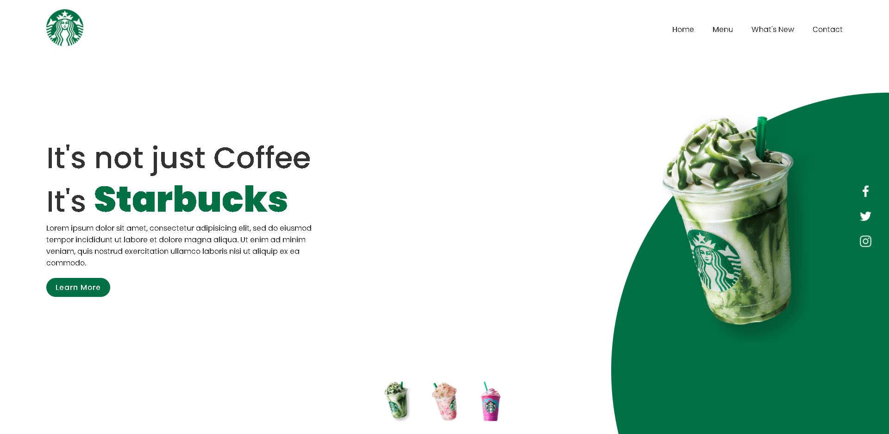

# Starbucks Landing Page

<h3>Responsive Landing Page using Html CSS &amp; JS</h3>

<menu>
  <li>Slide effect 'js'</li>
  <li>change BG Color Dynamically</li>
</menu>

# JavaScript Practice Template

<pre>
1st Day: 10/2/2022
first Dev session:      07:41 PM    ~   08:46 PM        ~ 01h 0m

</pre>

<pre><q>Challenge Completed in   01h 05m</q></pre>

 
 
 

# Pixel-Perfect Challenge

# Original Desgin: Online Tutorials YT

 
 
 
🍬 Leave a :star:&nbsp;if you like it, Please!🤩

 

📫 Please hit me up at mohammed.yuossry@gmail.com if you have any feedback or improvements.
